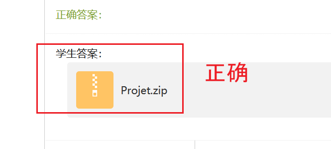
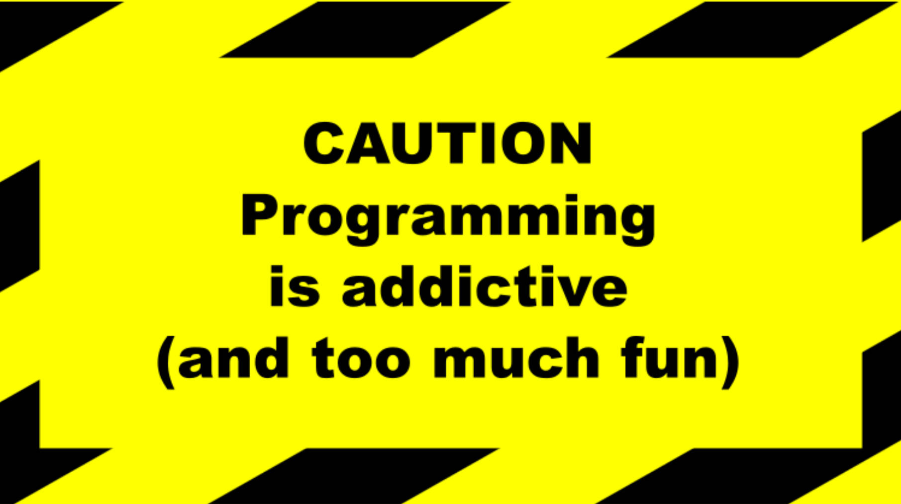
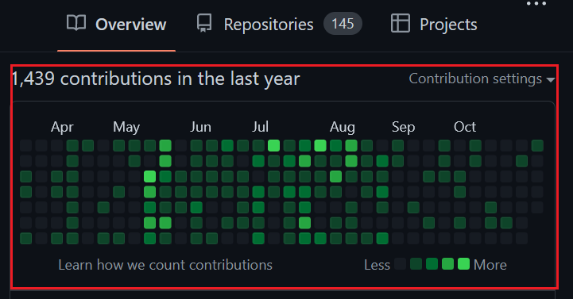

# LO02 C++ OOP Design Patterns


## :bell: 最新通知 - What's new

*最新通知会出现在这儿。每次上课前请查看。*

- [New] 项目截止日期：11月25日23点59。

## Lectures (Cours  Magistraux)

<details>

#### Course videos

:tv: Course videos by Prof. Antoine Jouglet are on Chaoxing Platform.

**You should watch the corresponding videos BEFORE the QA session of each Monday.**

#### Online QA session

Professor: Antoine Jouglet from UTC

Time: each Monday 18:00-20:45

Participer à la réunion Zoom 
- https://utc-fr.zoom.us/j/87273562034?pwd=V2ttWGFyekVWYTRISnFzTm5yYlgwZz09
- ID de réunion : 872 7356 2034 
- Code secret : 973229

</details>


## Travaux Dirigés (TD)

<details>

> 请大家上课带上耳机，上课时不时会需要使用，谢谢！

#### Time: 
Each Tuesday, Wednesday and Friday, 8:00 to 11:40

#### Classroom: 
D406

#### Tencent Meeting (VooV Meeting):

Room ID：958 9491 5777

#### Which Operating System to boot from:
Windows 10 

</details>

## Teaching Assistant

<details>

Mr. 张厚泽 is the TA for this course. Many thanks to him for helping out!

</details>


## Exercises & Solutions:

<details open>


#### List of all videos
- [中文] https://space.bilibili.com/472463946/channel/seriesdetail?sid=2086469

#### Table of content

Three forms of exercises are prepared :

- Exercises marked with :white_check_mark: : <br> Test Driven.

- Exercises marked with :heavy_minus_sign:  : <br> Fill in the ____.

- Exercises marked with :question: : <br> Some Base Code, Students Free To Do Exercise By Themselves.


Exercise | Solution  | Leetcode  | Video  | Reading Materials
---------------- | ----------------  | ----------------| ----------------| ----------------: 
[ex1](../../tree/ex1) | [ex1-ans](../../tree/ex1-ans)  | [leetcode-2235](https://leetcode.com/problems/add-two-integers/) | [video](https://www.bilibili.com/video/BV1124y1o71P/)|
[ex2](../../tree/ex2) | [ex2-ans](../../tree/ex2-ans) | | |
[ex3](../../tree/ex3) | [ex3-ans](../../tree/ex3-ans) | | | [blog](https://stackoverflow.com/questions/14517546/how-can-a-c-header-file-include-implementation)
[ex4](../../tree/ex4) | [ex4-ans](../../tree/ex4-ans)  |  [leetcode-509](https://leetcode.com/problems/fibonacci-number/) | [video](https://www.bilibili.com/video/BV1GP4y1Z7s1/) | [blog1](https://docs.microsoft.com/en-us/cpp/cpp/header-files-cpp?view=msvc-170) [blog2](https://www.learncpp.com/cpp-tutorial/header-guards/)
[ex5](../../tree/ex5) | [ex5-ans](../../tree/ex5-ans)  <br> [ex5-extended](../../tree/ex5-extended) | | | [blog](https://www.quora.com/Is-cout-an-object-or-a-function-Why)
[ex6](../../tree/ex6) | [ex6-ans](../../tree/ex6-ans) |  | | [blog1](https://www.learncpp.com/cpp-tutorial/variable-assignment-and-initialization/) [blog2](https://stackoverflow.com/questions/23345554/what-distinguishes-the-declaration-the-definition-and-the-initialization-of-a-v)
[ex7](../../tree/ex7)                   | [ex7-ans](../../tree/ex7-ans) | [leetcode-1929](https://leetcode.com/problems/concatenation-of-array/) | [video](https://www.bilibili.com/video/BV1uV4y1g7F4/)  | [blog](https://www.w3schools.com/CPP/cpp_variables_constants.asp)
[ex8](../../tree/ex8)                   | [ex8-ans-1](../../tree/ex8-ans-1) <br> [ex8-ans-2](../../tree/ex8-ans-2) | | | [blog](https://docs.microsoft.com/en-us/cpp/cpp/namespaces-cpp?view=msvc-170)
[ex9 :white_check_mark:](../../tree/ex9) | [ex9-ans-1](../../tree/ex9-ans-1) <br> [ex9-ans-2](../../tree/ex9-ans-2) <br> [ex9-ans-extended](../../tree/ex9-ans-extended)  | | | [blog1](https://www.ascii-code.com/) [blog2](https://www.programiz.com/cpp-programming/function-overloading)  [blog3](https://www.quora.com/How-did-one-come-up-with-42-being-the-answer-to-the-universe-or-is-it-a-hoax) [blog4](https://stackoverflow.com/questions/29796264/is-there-still-a-use-for-inline) [blog5](https://stackoverflow.com/questions/5057021/why-are-c-inline-functions-in-the-header)
[ex10 :white_check_mark:](../../tree/ex10) | [ex10-ans](../../tree/ex10-ans)  | | [video](https://www.bilibili.com/video/BV1Zb4y117iZ/) | [blog1](https://www.learncpp.com/cpp-tutorial/pointers-and-const/) [blog2](https://stackoverflow.com/questions/21476869/constant-pointer-vs-pointer-to-constant)
[ex11](../../tree/ex11) | [ex11-ans](../../tree/ex11-ans)  | [leetcode-709](https://leetcode.com/problems/to-lower-case/) | | [blog1](https://stackoverflow.com/questions/61915474/difference-between-const-reference-and-reference) [blog2](https://www.geeksforgeeks.org/const_cast-in-c-type-casting-operators/)
[ex12](../../tree/ex12) | [ex12-ans](../../tree/ex12-ans)  | [leetcode-344](../../tree/leetcode-344) |  | [blog1](https://www.tutorialspoint.com/differences-between-pass-by-value-and-pass-by-reference-in-cplusplus) [blog2](https://www.geeksforgeeks.org/how-to-print-size-of-an-array-in-a-function-in-c/) [blog3](https://stackoverflow.com/questions/2276329/why-can-one-specify-the-size-of-an-array-in-a-function-parameter) [blog4](https://stackoverflow.com/questions/3062005/size-of-array-passed-to-c-function) [blog5](https://www.quora.com/How-does-C-check-an-arrays-size-when-passing-by-reference)
[ex13](../../tree/ex13) | [ex13-ans](../../tree/ex13-ans)  | | [video](https://www.bilibili.com/video/BV1cf4y1E77w/) | [blog](https://www.codingninjas.com/blog/2020/07/27/understanding-pointers-references-in-c/) 
[ex14](../../tree/ex14) | [ex14-ans](../../tree/ex14-ans)  | | | [blog1](https://www.geeksforgeeks.org/default-arguments-c/) [blog2](https://en.cppreference.com/w/cpp/language/default_arguments)
[ex15](../../tree/ex15) | [ex15-ans](../../tree/ex15-ans)  |  |  | [blog1](https://www.programiz.com/cpp-programming/memory-management) [blog2](https://stackoverflow.com/questions/860447/what-is-the-array-form-of-delete)
[ex16](../../tree/ex16) | [ex16-ans](../../tree/ex16-ans) <br> [ex16-ans-extended](../../tree/ex16-ans-extended)  | | [video](https://www.bilibili.com/video/BV1234y1S72T) | [blog](https://stackoverflow.com/questions/30263303/stdarray-vs-array-performance)
[ex17](../../tree/ex17) | [ex17-ans](../../tree/ex17-ans)  | [leetcode-412](https://leetcode.com/problems/fizz-buzz/)  |  |
[ex18](../../tree/ex18) | [ex18-ans](../../tree/ex18-ans)  | | |
[ex19](../../tree/ex19) | [ex19-ans](../../tree/ex19-ans)  | | |
[ex20-q1](../../tree/ex20-q1) | [ex20-q1-ans](../../tree/ex20-q1-ans)  |  | [video](https://www.bilibili.com/video/bv1q64y187Ah)  | [blog](https://www.w3schools.com/cpp/cpp_oop.asp)
[ex20-q2](../../tree/ex20-q2)  | [ex20-q2-ans](../../tree/ex20-q2-ans)  | | | [blog1](https://stackoverflow.com/questions/9370493/inline-function-members-inside-a-class) [blog2](https://stackoverflow.com/questions/5306532/accessing-attributes-in-c-through-getters-setters) [blog3](https://www.positioniseverything.net/cpp-getters-and-setters/)
NAN  | [ex20-q3-ans-1](../../tree/ex20-q3-ans-1) <br> [ex20-q3-ans-2](../../tree/ex20-q3-ans-2) <br> [ex20-q3-ans-3](../../tree/ex20-q3-ans-3) <br> [ex20-q3-ans-4](../../tree/ex20-q3-ans-4) <br> [ex20-q3-ans-5](../../tree/ex20-q3-ans-5)  | | |
[ex20-q4 :white_check_mark:](../../tree/ex20-q4) | [ex20-q4-ans](../../tree/ex20-q4-ans)  | | |
NAN | [ex20-q5-ans-1](../../tree/ex20-q5-ans-1) <br>[ex20-q5-ans-2](../../tree/ex20-q5-ans-2)  | | | [blog](https://www.haroldserrano.com/blog/c-tip-14-dont-return-a-reference-when-you-must-return-an-object)
[ex20-q6](../../tree/ex20-q6) | [ex20-q6-ans](../../tree/ex20-q6-ans)  |  | | [blog1](https://www.javatpoint.com/cpp-destructor) [blog2](https://www.geeksforgeeks.org/this-pointer-in-c/) [blog3](https://www.quora.com/When-destructor-invoked-what-is-the-difference-between-the-pointer-to-an-object-and-the-object) [blog4](https://stackoverflow.com/questions/9965977/pointer-to-object-and-its-destructor)
NAN  | [ex20-q7-ans](../../tree/ex20-q7-ans)  | | | [blog1](https://drawio-app.com/uml-class-diagrams-in-draw-io/) [blog2](https://www.diagrams.net/blog/uml-class-diagrams) [blog3](https://www.javatpoint.com/uml-class-diagram) [blog4](https://www.uml-diagrams.org/class-reference.html)
[ex21](../../tree/ex21-q1)  |[ex21-csdn](../../tree/ex21-csdn) <br> [ex21-q1-ans-1](../../tree/ex21-q1-ans-1) <br> [ex21-q1-ans-2](../../tree/ex21-q1-ans-2)  | | [video](https://www.bilibili.com/video/bv183411276k) | [blog1](https://en.cppreference.com/w/cpp/language/operator_precedence) [blog2](https://en.cppreference.com/w/cpp/language/operators)  [blog3](https://blog.csdn.net/m0_37968340/article/details/74165221)
[ex21](../../tree/ex21-q1)  | [ex21-q2-ans](../../tree/ex21-q2-ans)  | | | [blog](https://stackoverflow.com/questions/36557340/implicit-conversion-from-int-to-a-class-type)
[ex21](../../tree/ex21-q1)  | [ex21-q3-ans](../../tree/ex21-q3-ans)  | | | [blog](https://docs.microsoft.com/en-us/cpp/cpp/increment-and-decrement-operator-overloading-cpp?view=msvc-160)
[ex21](../../tree/ex21-q1)  | [ex21-q4-ans](../../tree/ex21-q4-ans)  |  |  | [blog1](https://www.geeksforgeeks.org/overloading-stream-insertion-operators-c/) [blog2](https://learn.microsoft.com/en-us/cpp/standard-library/overloading-the-output-operator-for-your-own-classes?view=msvc-170)
NAN  | [ex22-q1-ans](../../tree/ex22-q1-ans)  |  [leetcode-1603](../../tree/leetcode-1603) |  [video](https://www.bilibili.com/video/bv1Mg411F7Zs)  | [blog1](https://www.runoob.com/cplusplus/cpp-exceptions-handling.html) [blog2](https://www.w3schools.com/cpp/cpp_exceptions.asp) [blog3](https://rollbar.com/blog/error-exceptions-in-c/#)
NAN  | [ex22-q2-ans](../../tree/ex22-q2-ans)  |  |  |
NAN  | [ex22-q3-ans](../../tree/ex22-q3-ans)  |  |  |
NAN  | [ex22-q4-ans](../../tree/ex22-q4-ans)  |  |  |
NAN  | [ex22-q5-ans-v1](../../tree/ex22-q5-ans-v1) <br> [ex22-q5-ans-v2](../../tree/ex22-q5-ans-v2) |  | |
NAN  | [ex23-q1-ans](../../tree/ex23-q1-ans)  |  | [video1](https://www.bilibili.com/video/bv1Su411f7iT) [video2](https://www.bilibili.com/video/bv1br4y127MK) | [blog1](https://www.geeksforgeeks.org/copy-constructor-in-cpp/) [blog2](https://www.learncpp.com/cpp-tutorial/overloading-the-assignment-operator/) [blog3](https://stackoverflow.com/questions/4172722/what-is-the-rule-of-three)
NAN  | [ex23-q2-ans](../../tree/ex23-q2-ans)  |   |  |  [blog1](https://stackoverflow.com/questions/4754763/object-array-initialization-without-default-constructor) [blog2](http://www.cplusplus.com/forum/general/49311/)  
NAN  | [ex23-q4-q5-ans](../../tree/ex23-q4-q5-ans)  |   |  | [blog](https://www.geeksforgeeks.org/destructors-c/)
NAN | [ex23-q7-ans](../../tree/ex23-q7-ans)  | | [video](https://www.bilibili.com/video/bv1tQ4y1D7xg)  | [blog1](https://stackoverflow.com/questions/121162/what-does-the-explicit-keyword-mean) [blog2](https://stackoverflow.com/questions/2814188/c-array-of-pointers-delete-or-delete) [blog3](https://stackoverflow.com/questions/21731888/deleting-array-of-pointers/21732015) [blog4](https://www.learncpp.com/cpp-tutorial/pointers-and-const/)
NAN | [ex23-q9-ans](../../tree/ex23-q9-ans)  | |  | [blog1](https://www.delftstack.com/howto/cpp/cpp-vector-implementation/) [blog2](https://www.geeksforgeeks.org/shallow-copy-and-deep-copy-in-c/) [blog3](http://www.fredosaurus.com/notes-cpp/oop-condestructors/shallowdeepcopy.html)
ex23-q3-q6-q8  | [ex23-composition-aggregation](../../tree/ex23-composition-aggregation) |  [leetcode-1476](../../tree/leetcode-1476)  <br> [leetcode-284-v1](../../tree/leetcode-284-v1)  <br>[leetcode-284-v2](../../tree/leetcode-284-v2)      | [video](https://www.bilibili.com/video/bv1dv411g7XY)         |  [blog1](https://stackoverflow.com/questions/885937/what-is-the-difference-between-association-aggregation-and-composition) [blog2](https://www.infoworld.com/article/3029325/exploring-association-aggregation-and-composition-in-oop.html) [blog3](https://stackoverflow.com/questions/25779394/c-association-aggregation-and-composition) [blog4](https://www.youtube.com/watch?v=N7xpnr8V6aQ)
ex23-q10-q11-q12-q13-q14  |  [ex23-q10-q11-q12-q13-q14-ans](../../tree/ex23-q10-q11-q12-q13-q14-ans) (todo) |          | [video](https://www.bilibili.com/video/BV1GP41177kd/) | [blog1](https://www.visual-paradigm.com/guide/uml-unified-modeling-language/uml-class-diagram-tutorial/) [blog2](https://pll.harvard.edu/course/cs50-introduction-computer-science?delta=0)
live code  | [ex24-static-keyword](../../tree/ex24-static-keyword) <br> [ex24-singleton-v1](../../tree/ex24-singleton-v1) <br>[ex24-singleton-v2](../../tree/ex24-singleton-v2)  <br>[ex24-singleton-v3](../../tree/ex24-singleton-v3) | | [video1](https://www.bilibili.com/video/BV1Jh411n7UD/) [video2](https://www.bilibili.com/video/BV1se411L7t3/) | [blog](https://www.geeksforgeeks.org/static-keyword-cpp/)
NAN  | [ex24-q1-ans-1](../../tree/ex24-q1-ans-1) <br> [ex24-q1-ans-2](../../tree/ex24-q1-ans-2)  <br>[ex24-q1-ans-3](../../tree/ex24-q1-ans-3)  | [leetcode-1286-v1](https://leetcode.com/problems/iterator-for-combination/discuss/1509630) <br> [leetcode-1286-v2](https://leetcode.com/problems/iterator-for-combination/discuss/1521899) |  | [blog1](https://stackoverflow.com/questions/10024834/singleton-synchronization-c) [blog2](https://stackoverflow.com/questions/11165852/java-singleton-and-synchronization) [blog3](https://sourcemaking.com/design_patterns/singleton) [blog4](https://en.wikipedia.org/wiki/Design_Patterns)
NAN  | [ex24-q2-q3-q4-q5-q6-ans](../../tree/ex24-q2-q3-q4-q5-q6-ans)  |  | [video1](https://www.bilibili.com/video/bv1ih411b7Xr/) <br> [video2](https://www.bilibili.com/video/BV1KV4y1572k)  | [blog1](https://www.w3schools.com/java/tryjava.asp?filename=demo_iterator_loop)   [blog2](https://leetcode.com/problems/iterator-for-combination/discuss/1509630) [blog3](https://www.geeksforgeeks.org/friend-class-function-cpp/) [blog4](https://stackoverflow.com/questions/131241/why-use-iterators-instead-of-array-indices) [blog5](https://stackoverflow.com/questions/22739507/iterator-and-memory-usage) [blog6](https://stackoverflow.com/questions/628903/performance-advantages-to-iterators) [blog7](https://stackoverflow.com/questions/1879255/performance-of-traditional-for-loop-vs-iterator-foreach-in-java) [blog8](https://www.internalpointers.com/post/writing-custom-iterators-modern-cpp) [blog9](https://medium.com/geekculture/iterator-design-pattern-in-c-42caec84bfc)
live code  | [ex24-q6-iterator-v0](../../tree/ex24-q6-iterator-v0)  <br>[ex24-q6-iterator-v1](../../tree/ex24-q6-iterator-v1)  <br>[ex24-q6-iterator-v2](../../tree/ex24-q6-iterator-v2)  <br>[ex24-q6-iterator-v3](../../tree/ex24-q6-iterator-v3)  <br>[ex24-q6-iterator-v4](../../tree/ex24-q6-iterator-v4) |  |  | [blog1](https://stackoverflow.com/questions/2728190/how-are-iterators-and-pointers-related) [blog2](https://stackoverflow.com/questions/30950285/is-an-iterator-in-c-a-pointer) [blog3](https://stackoverflow.com/questions/31128055/what-is-difference-between-iterators-and-pointers) [blog4](https://www.sandordargo.com/blog/2022/03/16/iterators-vs-pointers) [blog5](https://www.quora.com/What-is-an-iterator-in-C++-and-what-is-the-main-difference-between-it-and-a-pointer) [blog6](https://stackoverflow.com/questions/48410193/input-iterator-star-and-postfix-operator) [blog7](https://pvs-studio.com/fr/blog/posts/cpp/0093/) [blog8](https://hownot2code.wordpress.com/2016/06/30/use-a-prefix-increment-operator-i-in-iterators-instead-of-a-postfix-i-operator/) [blog9](https://learn.microsoft.com/en-us/cpp/cpp/increment-and-decrement-operator-overloading-cpp?view=msvc-170)  [blog10](https://leimao.github.io/blog/CPP-Const-Iterator/) [blog11](https://codereview.stackexchange.com/questions/202157/basic-iterator-supporting-vector-implementation)
NAN  | [ex26-ans](../../tree/ex26-ans)  | [leetcode-1480](https://leetcode.com/problems/running-sum-of-1d-array/) | [video](https://www.bilibili.com/video/bv1gR4y1n7Na)   | [blog1](https://www.softwaretestinghelp.com/graph-implementation-cpp/) [blog2](https://www.geeksforgeeks.org/difference-between-vector-and-list/) [blog3](https://www.geeksforgeeks.org/vector-in-cpp-stl/) [blog4](https://www.cplusplus.com/reference/vector/vector/) [blog5](https://www.cplusplus.com/reference/list/list/) [blog6](https://www.geeksforgeeks.org/initialize-a-vector-in-cpp-different-ways/) [blog7](https://www.geeksforgeeks.org/std-find-in-cpp/) 
live code  | [live-code-inheritance](../../tree/live-code-inheritance)  |  | [video1](https://www.bilibili.com/video/BV1h14y157Nw/) <br> [video2](https://www.bilibili.com/video/BV1zL4y1i7sr/) | [blog1](https://ee.usc.edu/~redekopp/cs104/slides/L08a_Inheritance.pdf) [blog2](http://ee.usc.edu/~redekopp/cs104/slides/L08b_Polymorphism.pdf)
NAN  | [ex27-q1-q2-q3-ans](../../tree/ex27-q1-q2-q3-ans)  |  |  | [blog1](https://www.programiz.com/cpp-programming/inheritance) 
NAN  | [ex27-q4-ans](../../tree/ex27-q4-ans)  |   |  | [blog](https://stackoverflow.com/questions/654428/what-is-the-order-in-which-the-destructors-and-the-constructors-are-called-in-c)
NAN  | [ex28-ans](../../tree/ex28-ans) (optional)   |   | [video](https://www.bilibili.com/video/BV1mb4y1b7kC/)  (optional) | [blog](https://www.tutorialspoint.com/cplusplus/cpp_inheritance.htm)
[ex29-q1](../../tree/ex29-q1) | [ex29-q1-ans](../../tree/ex29-q1-ans)  | | | [blog1](https://stackoverflow.com/questions/58042421/c-multi-level-inheritance-with-virtual-functions) [blog2](https://stackoverflow.com/questions/17842594/virtual-function-inheritance) [blog3](https://www.programiz.com/cpp-programming/function-overriding)  [blog4](https://www.programiz.com/cpp-programming/virtual-functions)
[ex29-q2](../../tree/ex29-q2) | [ex29-q2-ans](../../tree/ex29-q2-ans)  | |  |
[ex30](../../tree/ex30) | [ex30-ans](../../tree/ex30-ans)  | | | [blog1](https://stackoverflow.com/questions/16126578/vectors-and-polymorphism-in-c) [blog2](https://stackoverflow.com/questions/8790210/polymorphism-in-c-loss-of-type-in-vector-of-parent-class) [blog3](https://stackoverflow.com/questions/34383979/c-vector-of-base-class-objects) [blog4](https://stackoverflow.com/questions/4403726/learning-c-polymorphism-and-slicing) [blog5](https://schneide.blog/2015/07/06/object-slicing-breaking-polymorphic-objects-in-c/) [blog6](https://stackoverflow.com/questions/2575296/c-polymorphism-and-slicing)
NAN | [ex31-ans](../../tree/ex31-ans)  | [leetcode-1748](../../tree/leetcode-1748) <br> [leetcode-535](https://leetcode.com/problems/encode-and-decode-tinyurl/)  <br>[leetcode-1941](../../tree/leetcode-1941) <br> [leetcode-136](https://leetcode.com/problems/single-number/) | | [blog1](https://stackoverflow.com/questions/99297/how-are-virtual-functions-and-vtable-implemented) [blog2](https://isocpp.org/wiki/faq/virtual-functions) [blog3](https://www.freecodecamp.org/news/solid-principles-explained-in-plain-english/) [blog4](https://stackoverflow.com/questions/461203/when-to-use-virtual-destructors) [blog5](https://www.geeksforgeeks.org/virtual-destructor/)
NAN | [ex32-q1-ans](../../tree/ex32-q1-ans)  |  | [video](https://www.bilibili.com/video/BV1rv411T7LZ) | [blog](https://en.cppreference.com/w/cpp/container/vector)
live code  | [live-code-nested-class](../../tree/live-code-nested-class)  | | | [blog1](https://www.geeksforgeeks.org/nested-classes-in-c/) [blog3](https://learn.microsoft.com/en-us/cpp/cpp/nested-class-declarations?view=msvc-170)
NAN | [ex32-q2-ans](../../tree/ex32-q2-ans)  | | | [blog1](https://www.bogotobogo.com/DesignPatterns/factorymethod.php) [blog2](https://refactoring.guru/design-patterns/factory-method/cpp/example)
NAN | [ex33-ans](../../tree/ex33-ans)  | |  | [blog](https://stackoverflow.com/questions/500493/c-equivalent-of-javas-instanceof)
NAN | [ex35-q1-ans](../../tree/ex35-q1-ans) <br> [ex35-q1-extended](../../tree/ex35-q1-extended) | | [video](https://www.bilibili.com/video/BV17q4y1V7F3/)  | [blog](https://refactoring.guru/design-patterns/template-method/cpp/example)
NAN | [ex35-q2-ans-1](../../tree/ex35-q2-ans-1) <br> [ex35-q2-ans-2](../../tree/ex35-q2-ans-2)  <br>[ex35-q2-ans-3](../../tree/ex35-q2-ans-3) | [leetcode-1636](https://leetcode.com/problems/sort-array-by-increasing-frequency/discuss/1529350/)     |  | [blog1](https://refactoring.guru/design-patterns/observer/cpp/example) [blog2](https://stackoverflow.com/questions/461203/when-to-use-virtual-destructors) 
NAN | [ex36-ans](../../tree/ex36-ans)  <br> [ex36-extended](../../tree/ex36-extended) | | [video1](https://www.bilibili.com/video/bv1nP4y157dg) <br> [video2](https://www.bilibili.com/video/BV1nv4y1S7GH/) | [blog1](https://en.cppreference.com/w/cpp/language/using_declaration) [blog2](https://stackoverflow.com/questions/19237411/const-and-non-const-operator-overloading)
live code | [live-code-adaptor](../../tree/live-code-adaptor)  |  |   | 
NAN | [ex37-ans](../../tree/ex37-ans)  | [leetcode-20](https://leetcode.com/problems/valid-parentheses/) |  | [blog](https://refactoring.guru/design-patterns/strategy/cpp/example)
NAN | [ex38-q1-ans](../../tree/ex38-q1-ans)  |  [leetcode-844](https://leetcode.com/problems/backspace-string-compare/discuss/2628310)  |   | [blog1](https://stackoverflow.com/questions/6571381/dependent-scope-and-nested-templates) [blog2](https://stackoverflow.com/questions/495021/why-can-templates-only-be-implemented-in-the-header-file) [blog3](https://stackoverflow.com/questions/5612791/c-template-and-header-files) [blog4](https://www.bogotobogo.com/cplusplus/template_declaration_definition_header_implementation_file.php)
NAN | [ex38-q2-q3-ans](../../tree/ex38-q2-q3-ans)  | [leetcode-150](https://leetcode.com/problems/evaluate-reverse-polish-notation/) | | [blog1](https://stackoverflow.com/questions/35563193/) [blog2](https://stackoverflow.com/questions/11394832/) [blog3](https://stackoverflow.com/questions/5108359/how-do-i-define-a-template-function-within-a-template-class-outside-of-the-class) [blog4](https://stackoverflow.com/questions/10871100/pass-a-function-as-an-explicit-template-parameter) [blog5](https://stackoverflow.com/questions/1174169/function-passed-as-template-argument) [blog6](https://leetcode.com/problems/sort-array-by-increasing-frequency/discuss/1529350/) [blog7](https://stackoverflow.com/questions/16948567/array-operator-overloading-const-and-non-const-versions) [blog8](https://stackoverflow.com/questions/63730953/operator-overloading-with-const-and-non-const-versions)
NAN | [ex40-ans](../../tree/ex40-ans)  | [leetcode-2215](https://leetcode.com/problems/find-the-difference-of-two-arrays/discuss/2743574) | [video](https://www.bilibili.com/video/BV1xq4y1u7Jo/) | [blog1](https://cppbetterexplained.com/c-template-metaprogramming-in-practice/) [blog2](https://embeddedartistry.com/blog/2017/08/02/an-overview-of-c-stl-containers/) [blog3](https://stackoverflow.com/questions/2196995/is-there-any-advantage-of-using-map-over-unordered-map-in-case-of-trivial-keys) [blog4](https://www.modernescpp.com/index.php/surprise-included-inheritance-and-member-functions-of-class-templates) [blog5](https://hsf-training.github.io/hsf-training-cpp-webpage/10-templates/index.html) [blog6](https://stackoverflow.com/questions/8810224/inheriting-from-a-template-class-in-c) [blog7](https://www.cs.technion.ac.il/users/yechiel/c++-faq/nondependent-name-lookup-types.html)

</details>

## Exam Revision


<details open>

#### Mid-term exam revision

*Note: I make those videos so as to help you revise more targetedly. It represents significant extra work (for free) on my side.*

For mid-term exam revision,  [Ex23_Ex24_solution.pdf](../../tree/master/pdf/Ex23_Ex24_solution.pdf) will help a lot, and [LO02_poly_exercices.pdf](../../tree/master/pdf/LO02_poly_exercices.pdf) is your best friend.

- **Mid-term exam revision #1 - Ex70 (poly exercise)**
    - Video:
        - https://www.bilibili.com/video/BV1dP411J7k2/

#### Final exam revision

*Note: I make those videos so as to help you revise more targetedly. It represents significant extra work (for free) on my side.*

For final exam revision, [LO02_poly_exercices.pdf](../../tree/master/pdf/LO02_poly_exercices.pdf) is your best friend, and practicing STL containers with above-listed leetcode will help a lot.

- **Final exam revision #1 - Ex75 (poly exercise)**
    - Branches:
        - [ex75-ans-v1](../../tree/ex75-ans-v1) 
        - [ex75-ans-v2](../../tree/ex75-ans-v2)  
        - [ex75-ans-v3](../../tree/ex75-ans-v3) 
    - Video:
        - https://www.bilibili.com/video/BV1Y14y1p7mP/

- **Final exam revision #2 - live code - containers**
    - Main idea 1: An ```std::map``` inside of a ```std::list```, for counting numbers, and iterate through the ```std::list``` by number of occurance. Each element appears only once in the ```std::list```, emulating hence a ```std::set```.
    - Main idea 2: An ```std::map``` inside of a ```std::map```, for counting numbers, and iterate through the ```std::map``` by number of occurance, instead of by order of value. 
    - Main idea 3: An ```std::set``` inside of a ```std::vector``` and iterate through the ```std::vector``` by order of value. When printing, the number of occurence will also be printed, emulating hence a *Counter* in Python.
    - Branches:
        - [live-code-containers-v1](../../tree/live-code-containers-v1) 
        - [live-code-containers-v2](../../tree/live-code-containers-v2) 
        - [live-code-containers-v3](../../tree/live-code-containers-v3) 
        - [live-code-containers-v4](../../tree/live-code-containers-v4) 
        - [live-code-containers-v5](../../tree/live-code-containers-v5) 
    - Video:
        - https://www.bilibili.com/video/BV1UD4y1i7Cu/
    - Template: 
        - I showcase only with ```char``` and ```int```. It's up to you to make it a  template class.
    - Blogs:
        - [blog1](https://isocpp.org/wiki/faq/strange-inheritance) [blog2](https://cplusplus.com/reference/map/map/)  [blog3](https://www.cse.msu.edu/~cse232/us22/slides/cse232_associative_containers.pdf) [blog4](https://www.ida.liu.se/~TDDD38/lecture/slides/stl_II.pdf) [blog5](https://cplusplus.com/reference/set/set/) [blog6](https://en.cppreference.com/w/cpp/container/map/insert) [blog7](https://stackoverflow.com/questions/966905/stuck-on-c-template-deriving-from-stdmap) [blog8](https://stackoverflow.com/questions/6806173/subclass-inherit-standard-containers/7110262#7110262) [blog9](https://stackoverflow.com/questions/4353203/thou-shalt-not-inherit-from-stdvector)

- **Final exam revision #3 - in depth - dig deeper into iterator**
    - Video:
        - TODO

    - Branches:
        - [in-depth-iterator](../../tree/in-depth-iterator)

- **Final exam revision #4 - in depth - dig deeper into ```dynamic_cast```**
    - Code
    ```cpp
    struct A {
        virtual void fa() {}
    };

    struct B {
        virtual void fb() {}
    };

    int main() {
        A *pa = new B;
        pa->fa();

        B * pb = dynamic_cast<B *>(pa);
        if (pb)
            pb->fb();
    }
    ```
    - Main topic: ```dynamic_cast```
    - Video:
        - TODO

    - Branches:
        - [in-depth-dynamic_cast](../../tree/in-depth-dynamic_cast)

    - Reading materials:
        - https://learn.microsoft.com/en-us/cpp/cpp/dynamic-cast-operator?view=msvc-170

- **Final exam revision #5 - Ex76 (poly exercise)**
    - Branches:
        - [ex76-ans](../../tree/ex76-ans) 
    - Video:
        - TODO


</details>

## Project

<details>


#### Project

Dans le cadre de cet UV, vous travaillerez par groupe sur un projet C++ en rapport avec le contenu de votre cours et des TDs.
- Chaque groupe sera formé de 4 à 5 étudiants.
- Vous devrez rendre un livrable le ?? novembre à 23h59 au plus tard (!) sur: "Chaoxing Plateform" - Section Homework (作业).

#### Project description:
[:books: Project description in pdf](../../tree/master/project)


#### Forming teams: 

https://docs.qq.com/doc/DT1R1RFdJdFRSUHVw


#### 提交项目
- 超星平台-作业-Projet
- 将 pdf文件(文件里面包含视频的bilibili链接)、代码文件夹（未压缩），放在同一个文件夹（文件夹命名为 Projet，注意没有 'c' 字母, 'P'字母大写），然后将Projet文件夹压缩成一个 zip 文件（命名为 Projet.zip，注意没有 'c' 字母, 'P'字母大写）。然后上传 zip 文件作为本题的答案即可。
- 每个小组只需要一个人提交就行。
- 提交后检查一下网页的显示：

正确示例:


#### 往届学生优秀 project 作品 (videos)

You could get some inspirations from those projects, realized by students from past promotions. 

Be innovative. You can do even better.

##### 2021 Fall
- https://www.bilibili.com/video/BV1x341187wn
- https://www.bilibili.com/video/BV1bL4y1v7FY

#### 往届学生优秀 project 作品 (rapport pdf)
- [往届学生优秀 project 作品 (rapport pdf)](../../tree/master/往届学生优秀作品)

> By default, you agree to share your project report on this platform. If you disagree, tell me in private chat. 

#### If you want some suggestions for your project ...
- Whenever possible, use ```std::vector``` (or other STL containers) instead of built-in arrays.
- Pay attention to code readability. Profs read every code file when grading.
- GUI (Graphic User Interface) is not essential. It might help give a good first impression.
- Use as many *Design Patterns* as possible, but only when appropriate.

#### 关于重修
重修的同学，去年项目分数是可以保留的，也可以今年重新做，刷新分数。

不过，公平起见，重修的同学的往年项目分数不会透漏。是否重做项目，大家自己把握。

#### On academic misconduct
Just a note to remind everyone what is OK and what is not OK in terms of talking to other students about projects.

It is **DEFINITELY OK** to:

- discuss the assignment in general terms (what do they mean by a copy constructor?)
- discuss how different C++ standard library functions work (different ways to insert an element in a ```std::vector```)
- discuss strategies for successful implementation 
- help others debug their code and find problems

It is **NOT OK** to:

- bug someone else for a lot of help (particularly if they are already done!)
- share your code directly with other people/project groups 

Discovery of any inappropriate code sharing will lead to harsh penalties for all involved parties. We expect that all students will conduct themselves with honesty and integrity.

#### UML with Draw.io

Draw.io is very popular in the academy as well as in the industry.

Download the software:
- From GitHub: https://github.com/jgraph/drawio-desktop/releases
- From Baidu: just Baidu search "Draw.io 下载".

Online version: 
- https://app.diagrams.net/

#### Last but not least



</details>


## Notes & Exams:


<details>
Voici comment seront calculées les notes de l'UV (sur un total de 105, au lieu de 100): 

- L'examen mi-terme : 35% 
- Le projet : 30% 
- L'examen final : 40%

Some further clarifications on mid-term/final exam:

- You could print the pdf of poly_cours_opt and bring it with you. Your personal paper notebooks are NOT allowed. The poly d’exercices corrigés is NOT allowed. Chinese textbooks are NOT allowed. Any other reference book is NOT allowed.
- Dictionaries in paper format are allowed.
- Dictionaries on smartphone are NOT allowed. All electronic devices are forbidden of use during exam.
- If you have difficulties writing your answers in French, you could answer in English. Don't write your answer in Chinese. 

#### Answer sheet for exams：

1. 答题纸**单面**答题。因为答题纸需要扫描发给法国老师。
1. 每张答题纸最上面写上学号、中文姓名、姓名拼音。
1. 每张答题纸最上面写上序号，比如 1/4, 2/4, 3/4, 4/4。
1. 法方老师反馈，考试的时候卷面分占有一定比值(10%)。请大家答题时保持清晰、整洁。可以适当使用涂改液或者修正带(在不影响扫描的前提下)。
</details>

## Asking Questions

<details closed>

#### 使用 **[Gitee Issue](https://gitee.com/lundechen/cpp/issues)** 提问
By default, you should ask questions via **[Gitee Issue](https://gitee.com/lundechen/cpp/issues)**. Here is how:
- https://www.bilibili.com/video/BV1364y1h7sb/

#### Principe
Here is the principle for asking questions:

>  **Google First, Peers Second, Profs Last.**

You are expected to ask questions via **[Gitee Issue](https://gitee.com/lundechen/cpp/issues)**. However, as a **secondary**  (and hence, less desirable, less encouraged) choice, 
you could also 
ask questions in the WeChat group.

> Why Gitee Issue? Because it's simply more **professional**, and better in every sense.

In Gitee Issue and the WeChat group, questions will be answered selectively. 

Questions won't be answered if:
- they could be solved on a simple Google search
- they are out of the scope of the course
- they are well in advance of the progress of the course
- professors think that it's not interesting for discussion

#### Regarding personal WeChat chats:
- **Questions asked in personal WeChat chats will NOT be answered.**
- **Messages sent after 21:00 in personal chats will be extremely unwelcome.**

Learning how to use Google & Baidu & Bing to solve programming problems is an important skill you should develop during this course.

Pour des questions privées, merci d'envoyer vos questions par mail à ces adresses ci-dessous :
- lundechen@shu.edu.cn (Lunde Chen)
- antoine.jouglet@hds.utc.fr (Antoine Jouglet)

#### Office visit

Office visit is NOT welcome unless you make an appointment at least one day in advance.

</details>


## Misc

<details>


#### Textbooks, slides, exercises in pdf

[:books: Textbooks, slides, exercises in pdf](../../tree/master/pdf)


#### They have been there as well ... and got an A/B!

Suggestions from students who got an A or B: 
- [往届学生的学习方法总结](../../tree/master/往届学生的学习方法总结)

> If you got an A or B and want to share your experience, you can write it down and send it to me via private chat.

#### Books

See this branch:
- [books](../../tree/books)

#### Bilibili Videos


##### :hammer: Install CLion and Git

- [Install CLion and Git](https://www.bilibili.com/video/BV1cq4y1S7Be)
- https://gitee.com/lundechen/hello

> Clion 2020.1 版本无法激活的同学，可以尝试下载 CLion 2022.2，然后激活：https://docs.qq.com/doc/p/41f1c0098815f3d0a6cbb3f9ad2b2312de4b43b3?dver=3.0.0

##### :rocket: How to manipulate with git during TD sessions
- [B站视频 - 编程课程使用Git-师生交互-简单场景-以算法入门为例](https://www.bilibili.com/video/BV1gu411Q7T3/)
- Basically, you will use ```git stash```, ```git pull```  and ```git checkout``` most of the time.
- LO02 C++ 相比 LO01 算法入门，主要是多了一个 git checkout（简单场景）。

##### How to push your code to GitHub
- [B站视频 - 学生如何将自己的代码 push 到 GitHub - 以 LO02 C++ 为例](https://www.bilibili.com/video/BV188411Y7Uf/)

##### :bug: :bug: :bug: :bug: Debug
For debugging with CLion, watch this:
- [B站视频 - CLion Debug](https://www.bilibili.com/video/BV1u44y167jP/)

> 有红色波浪线，不能编译，那就不能 debug。


#### Flipped Classroom

Watching videos before coming to classroom.

- [Stanford CS229 Machine Learning course](https://www.youtube.com/watch?v=jGwO_UgTS7I&list=PLoROMvodv4rMiGQp3WXShtMGgzqpfVfbU)
- https://www.researchgate.net/figure/Students-perceptions-toward-watching-videos-prior-to-class_tbl2_292155097
- https://en.wikipedia.org/wiki/Flipped_classroom
- https://bokcenter.harvard.edu/flipped-classrooms
- https://www.sciencedirect.com/science/article/abs/pii/S0360131521002761 

#### How to clone this repository

##### Method 1:

```shell
git clone https://gitee.com/lundechen/cpp.git 
```

Then open the ```cpp``` folder with CLion.


##### Method 2:

In CLion, click ```VCS``` -> ```Get From Version Control```, input the url:
```text
https://gitee.com/lundechen/cpp.git 
```

Then click ```clone```.


#### When your CLion project seems broken:


- 重新 clone （VCS->Get from Version Control）试试

- 关闭所有的代码编辑tab，然后再次打开代码文件。

- 或者关了 CLion, 删除项目的 .idea 文件夹，然后再次打开 Clion


#### Cpp and design patterns courses in other universities

See this branch:
- [cpp-in-other-universities](../../tree/cpp-in-other-universities)

#### Zen of Python

https://peps.python.org/pep-0020/
```text
Beautiful is better than ugly.

Explicit is better than implicit.

Simple is better than complex.

Complex is better than complicated.

Flat is better than nested.

Sparse is better than dense.

Readability counts.

Special cases aren't special enough to break the rules.

Although practicality beats purity.

Errors should never pass silently.

Unless explicitly silenced.

In the face of ambiguity, refuse the temptation to guess.

There should be one-- and preferably only one --obvious way to do it.

Although that way may not be obvious at first unless you're Dutch.

Now is better than never.

Although never is often better than *right* now.

If the implementation is hard to explain, it's a bad idea.

If the implementation is easy to explain, it may be a good idea.

Namespaces are one honking great idea -- let's do more of those!
```

#### Zen of C++

https://www.reddit.com/r/cpp/comments/48obqd/what_is_the_rcpp_c_equivalent_of_the_the_zen_of/

```text
Not too ugly is better than really ugly.

Explicit is better than implicit, but bad defaults are worse than either.

A simple implementation is better than a complicated one.

A complicated implementation is better than a complex interface.

Contiguous is better than pointer chasing.

Pointer chasing is better than double pointer chasing.

Readability is important; so C++ being what it is, write lots of comments.

Special cases will require breaking the rules, but try to keep the rule breaking hidden.

That said, if you can't hide the rule breaking, a practical impure solution to a smaller problem is better than a pure impractical solution to the generic problem.

Don't use error codes.

Unless their checking is statically enforced.

In the face of ambiguity, don't compile.

There will be many ways to do everything; know their trade-offs and be an engineer and pick one!

Although the cleanest, most maintainable way will not be obvious at first unless you read books and watch talks from a lot of really smart people.

2011 is better than never.

Though never can be better if you haven't thought it through.

If the interface easily causes undefined behavior, it's a bad idea.

If the implementation is safe, it may be a good idea.

Const is a honking great idea, use it everywhere you can!
```

#### Code style [optional]

- https://google.github.io/styleguide/cppguide.html
- https://www.reddit.com/r/cpp/comments/8oja7y

CLion can help us reformat code.

#### Very Basic Markdown [optional]
You might need to use triple backquotes (\`) to make your code
in Gitee Issue more beautifully rendered:

##### Example 1

\`\`\`cpp<br>
int main() {<br>
&nbsp;&nbsp;&nbsp;&nbsp; std::cout << "Hello, World!" << std::endl;<br>
&nbsp;&nbsp;&nbsp;&nbsp;    return 0;<br>
}<br>
\`\`\`<br>

will render in markdown as:


```cpp
int main() {
    std::cout << "Hello, World!" << std::endl;
    return 0;
}
```

##### Example 2

\`\`\`static\`\`\` will render as: ```static```.


#### Detecting memory leak with Linux tools [optional]

- https://www.cprogramming.com/debugging/valgrind.html

- https://stackoverflow.com/questions/5360491/how-i-can-detect-memory-leaks-of-c-application-in-linux-ubuntu-os

- https://www.networkworld.com/article/3006625/review-5-memory-debuggers-for-linux-coding.html?page=2

```
valgrind --tool=memcheck <your_app> <your_apps_params>
```

#### g++ v.s. CMake v.s. makefile [optional]

```gcc``` is used to compile C program while ```g++``` is used to compile C++ program.

https://www.cvl.isy.liu.se/education/graduate/opencv/CMake%20presentation.pdf 

https://courses.cs.washington.edu/courses/cse326/00sp/unix/g++.html

https://cmake.org/cmake/help/latest/guide/tutorial/A%20Basic%20Starting%20Point.html

https://www.softwaretestinghelp.com/cpp-makefile-tutorial/

#### Very basic Boost library [optional]

https://www.tutorialspoint.com/advanced-cplusplus-with-boost-library

https://www.boost.org/doc/libs/

Other Cpp open source libraries:
- https://en.cppreference.com/w/cpp/links/libs
- https://github.com/fffaraz/awesome-cpp


#### Online C/C++ Compiler

If you are stuck with your CLion configuration during TP sessions, you could write and run your code online:

- https://www.onlinegdb.com/online_c_compiler
- https://www.online-cpp.com/online_c++_editor


#### Test Driven Development

Cpp test with CLion

TODO.


If you are interested in making LO01 and LO02 exercised test driven, please contact me.


#### How to push your code to GitHub

##### 1. Create a repo on GitHub

You might want to add your ```id_rsa.pub``` to GitHub so that 
you won't need to input your GitHub user name and password in the terminal each time. You can refer to this blog as to how:

- https://jdblischak.github.io/2014-09-18-chicago/novice/git/05-sshkeys.html if you cannnot browse it, here is a local backup of the web page: [sshkeys.html](html/blog-SSH%20Keys%20for%20GitHub.html)


##### 2. Add the repo as a remote 
```
git remote add github <YOUR-SSH-OR-HTTPS-REPO-URL>
```
##### 3. push the branch to GitHub repo

```
git checkout -b <NEW BRANCH NAME>
git add .
git commit -m "<SOME MESSAGE>"
git push github <NEW BRANCH NAME>
```

Corresponding video:
- https://www.bilibili.com/video/BV188411Y7Uf/

#### Why do we use Gitee/GitHub in this course?

I learned this approach of teaching from Prof. Fabien Pfaender, the French Dean of UTSEUS. I was so impressed. It was another level.

Here in this course of LO02, we are using a very basic and simple form of teaching/learning with git/GitHub/Gitee. In the course of Introduction To Machine Learning, a more sophisticated approach will be employed.

#### Why you should use GitHub: Lessons for the classroom and newsroom

- https://www.storybench.org/use-github-lessons-classroom-newsroom/

#### How do you use Issues in your class?
- https://education.github.community/t/how-do-you-use-issues-in-your-class/

#### Why leetcode?

- Because it's fun.


#### Keep things in perspective

Some programmers argue that "Object Oriented Programming is Inherently Harmful":

- http://harmful.cat-v.org/software/OO_programming/

- https://nccastaff.bournemouth.ac.uk/jmacey/Lectures/DesignPatterns/lecture1/#/1/4


#### Design patterns repositories on GitHub 

Those resources, found by googling "GitHub cpp design patterns", could be interesting for some of you:
- https://github.com/JakubVojvoda/design-patterns-cpp
- https://github.com/pezy/DesignPatterns
- https://github.com/RefactoringGuru/design-patterns-cpp
- https://github.com/fsaadatmand/Head-First-Design-Pattern-CPP-Examples


#### Career advice
In general I don't give any career or life advices to anyone. I am a liberal and believe that the beauty of life lies in its diversity and randomness, hence an infinity of possibilities. The meaning of life is 42, *, anything, everything. Giving advices to people is limiting and more often than not unhelpful.

However, if you aspire to be a programmer, it might be worth it to build your GitHub profile, by contributing to interesting projects (personal or open-souce) and, accumulating Green Blocks, like this:



A GitHub profile with a lot of Green Blocks will make your CV more attactive.

#### xkcd

> Life is short. Let's code in C++, to make it even shorter.

- [Pointers](https://www.explainxkcd.com/wiki/index.php/138:_Pointers)
- [Real Programmers](https://xkcd.com/378/)
- [Error Code](https://www.explainxkcd.com/wiki/index.php/1024:_Error_Code)
- [Compiling](https://www.explainxkcd.com/wiki/index.php/303:_Compiling)
- [Wisdom of the Ancients](https://www.explainxkcd.com/wiki/index.php/979:_Wisdom_of_the_Ancients)
- [Tech Support](https://www.explainxkcd.com/wiki/index.php/806:_Tech_Support)
- [ISO 8601](https://www.explainxkcd.com/wiki/index.php/1179:_ISO_8601)
- [Exploits of a Mom](https://www.explainxkcd.com/wiki/index.php/327:_Exploits_of_a_Mom)

For more C++/Programming related funny images, here is a branch:
- [funny](../../tree/funny)


#### Online Final Exam

线上考试的同学登记一下: 

- https://docs.qq.com/doc/DT1VoYndvV0phZEha


Url for online exam will appear here.


在线考试的同学注意：

试卷答题里面（即拍的照片里面），一定要有自己的学号姓名。

1001班: 958 9491 5777

1002班: 601-8612-3874


</details>

## Conclusion
<details>

If you like this course and want to thank me personally, please go to <br> https://github.com/open-academy/machine-learning <br> and give it a star. Thank you!


</details>
