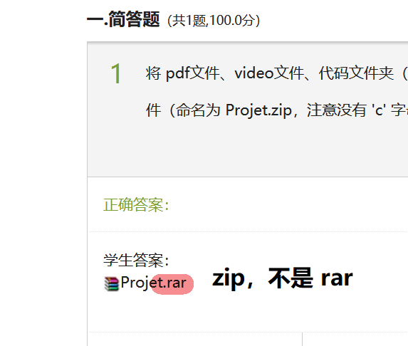
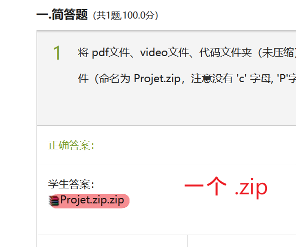

# LO02 C++ 2021

## Course videos

:tv: Course videos are on Chaoxing Platform

## Online QA with Zoom, each Monday 18:00-20:40

Participer à la réunion Zoom https://utc-fr.zoom.us/j/87273562034?pwd=V2ttWGFyekVWYTRISnFzTm5yYlgwZz09

ID de réunion : 872 7356 2034 

Code secret : 973229

## Install CLion and Git

[:computer: Install CLion and Git](https://gitee.com/lundechen/hello)

## Textbooks, slides, exercises in pdf

[:books: Textbooks, slides, exercises in pdf](../../tree/master/pdf)

## TD

#### Time: 
each Thursday, Wednesday and Friday, 8:00 to 11:40

#### Classroom: 
D413

#### Tencent Meeting:

点击链接入会，或添加至会议列表：

https://meeting.tencent.com/s/ckxVNof1hVka?rs=25

**会议 ID：958 9491 5777**

会议直播：

https://meeting.tencent.com/l/TfmYIwVlqSVP
 
#### Which Operating System to boot from:
Win-10-C-HPD413/6

#### When you are blocked with CLion:

- 重新 clone （VCS->Get from Version Control）试试

- 或者关了 CLION, 删除项目的 .idea 文件夹，然后再次打开 Clion

#### Questions & Solutions:

Exercise | Solution  | Leetcode  | Video | Reading Materials
---------------- | ----------------  | ----------------| ----------------| ----------------: 
[ex1](../../tree/ex1) | [ex1-ans](../../tree/ex1-ans)  | | |
[ex2](../../tree/ex2) | [ex2-ans](../../tree/ex2-ans) | | |
[ex3](../../tree/ex3) | [ex3-ans](../../tree/ex3-ans) | | |
[ex4](../../tree/ex4) | [ex4-ans](../../tree/ex4-ans)  | | |
[ex5](../../tree/ex5) | [ex5-ans](../../tree/ex5-ans)  | | |
[ex5](../../tree/ex5) | [ex5-extended](../../tree/ex5-extended) | | |
[ex6](../../tree/ex6) | [ex6-ans](../../tree/ex6-ans) | | | [blog](https://www.learncpp.com/cpp-tutorial/variable-assignment-and-initialization/)
NAN                   | [ex7-ans](../../tree/ex7-ans) | | |
NAN                   | [ex8-ans-1](../../tree/ex8-ans-1) | | |
 NAN                   | [ex8-ans-2](../../tree/ex8-ans-2) | | |
[ex9](../../tree/ex9) | [ex9-ans-1](../../tree/ex9-ans-1)   | | | 
[ex9](../../tree/ex9) | [ex9-ans-2](../../tree/ex9-ans-2)  | | | [blog1](https://stackoverflow.com/questions/29796264/is-there-still-a-use-for-inline) [blog2](https://stackoverflow.com/questions/5057021/why-are-c-inline-functions-in-the-header)
[ex9](../../tree/ex9) | [ex9-ans-extended](../../tree/ex9-ans-extended)  | | |
[ex10](../../tree/ex10) | [ex10-ans](../../tree/ex10-ans)  | | |
[ex11](../../tree/ex11) | [ex11-ans](../../tree/ex11-ans)  | | |
[ex12](../../tree/ex12) | [ex12-ans](../../tree/ex12-ans)  | [leetcode-344](../../tree/leetcode-344) | [video](https://www.bilibili.com/video/BV1Zb4y117iZ/) |
NAN | [ex13-ans](../../tree/ex13-ans)  | |
[ex14](../../tree/ex14) | [ex14-ans](../../tree/ex14-ans)  | | |
[ex15](../../tree/ex15) | [ex15-ans](../../tree/ex15-ans)  |  | [video](https://www.bilibili.com/video/BV1cf4y1E77w/) |
[ex16](../../tree/ex16) | [ex16-ans](../../tree/ex16-ans)  | | |
[ex17](../../tree/ex17) | [ex17-ans](../../tree/ex17-ans)  |   |  [video](https://www.bilibili.com/video/BV1234y1S72T) |
[ex18](../../tree/ex18) | [ex18-ans](../../tree/ex18-ans)  | | |
[ex19](../../tree/ex19) | [ex19-ans](../../tree/ex19-ans)  | | |
[ex20](../../tree/ex20-q1) | [ex20-q1-ans](../../tree/ex20-q1-ans)  | | |
[ex20](../../tree/ex20-q1)  | [ex20-q2-ans](../../tree/ex20-q2-ans)  | | |
[ex20](../../tree/ex20-q1)  | [ex20-q3-ans-1](../../tree/ex20-q3-ans-1)  | | |
[ex20](../../tree/ex20-q1)  | [ex20-q3-ans-2](../../tree/ex20-q3-ans-2)  |  | |
[ex20](../../tree/ex20-q1)  | [ex20-q3-ans-3](../../tree/ex20-q3-ans-3)  | | |
[ex20](../../tree/ex20-q1)  | [ex20-q3-ans-4](../../tree/ex20-q3-ans-4)  | | |
[ex20](../../tree/ex20-q1)  | [ex20-q3-ans-5](../../tree/ex20-q3-ans-5)  | | |
[ex20-q4](../../tree/ex20-q4) | [ex20-q4-ans](../../tree/ex20-q4-ans)  | | |
NAN | [ex20-q5-ans-1](../../tree/ex20-q5-ans-1)  | | |
NAN | [ex20-q5-ans-2](../../tree/ex20-q5-ans-2)  | |  [video](https://www.bilibili.com/video/bv1q64y187Ah) |
[ex20-q6](../../tree/ex20-q6) | [ex20-q6-ans](../../tree/ex20-q6-ans)  | [leetcode-1941](../../tree/leetcode-1941) | | 
NAN  | [ex20-q7-ans](../../tree/ex20-q7-ans)  | | |
[ex21](../../tree/ex21-q1)  | [ex21-q1-ans-1](../../tree/ex21-q1-ans-1)  | | | [blog](https://blog.csdn.net/m0_37968340/article/details/74165221)
[ex21](../../tree/ex21-q1)  | [ex21-q1-ans-2](../../tree/ex21-q1-ans-2)  | |  | [blog](https://en.cppreference.com/w/cpp/language/operators)
[ex21](../../tree/ex21-q1)  | [ex21-q2-ans](../../tree/ex21-q2-ans)  | | | [blog](https://stackoverflow.com/questions/36557340/implicit-conversion-from-int-to-a-class-type)
[ex21](../../tree/ex21-q1)  | [ex21-q3-ans](../../tree/ex21-q3-ans)  | | | [blog](https://docs.microsoft.com/en-us/cpp/cpp/increment-and-decrement-operator-overloading-cpp?view=msvc-160)
[ex21](../../tree/ex21-q1)  | [ex21-q4-ans](../../tree/ex21-q4-ans)  | [leetcode-1748](../../tree/leetcode-1748) | [video](https://www.bilibili.com/video/bv183411276k) |
NAN  | [ex22-q1-ans](../../tree/ex22-q1-ans)  |  |  |
NAN  | [ex22-q2-ans](../../tree/ex22-q2-ans)  |  |  |
NAN  | [ex22-q3-ans](../../tree/ex22-q3-ans)  | [leetcode-1603](../../tree/leetcode-1603) |  |
NAN  | [ex22-q4-ans](../../tree/ex22-q4-ans)  |  |  |
NAN  | [ex22-q5-ans](../../tree/ex22-q5-ans)  |  | [video](https://www.bilibili.com/video/bv1Mg411F7Zs) |
NAN  | [ex23-q1-ans](../../tree/ex23-q1-ans)  |  | [video](https://www.bilibili.com/video/bv1Su411f7iT) |
10-01 Holiday  | [ex23-ex24-solution-pdf](../../tree/master/pdf/Ex23_Ex24_solution.pdf)  |  |  |
NAN  | [ex23-q2-ans](../../tree/ex23-q2-ans)  |   |  |  [blog1](https://stackoverflow.com/questions/4754763/object-array-initialization-without-default-constructor) [blog2](http://www.cplusplus.com/forum/general/49311/) [blog3](http://www.cplusplus.com/forum/general/49311/) 
NAN  | [ex23-q4-ans](../../tree/ex23-q3-q4-q5-ans)  |  |  |
NAN  | [ex23-q5-ans](../../tree/ex23-q3-q4-q5-ans)  |   | [video](https://www.bilibili.com/video/bv1br4y127MK) | [blog](https://www.geeksforgeeks.org/destructors-c/)
NAN | [ex23-q7-ans](../../tree/ex23-q6-q7-q8-ans)  | |  | [blog1](https://stackoverflow.com/questions/121162/what-does-the-explicit-keyword-mean) [blog2](https://stackoverflow.com/questions/2814188/c-array-of-pointers-delete-or-delete) [blog3](https://stackoverflow.com/questions/21731888/deleting-array-of-pointers/21732015)
NAN | [ex23-q9-ans](../../tree/ex23-q9-ans)  | | [video](https://www.bilibili.com/video/bv1tQ4y1D7xg) | [blog1](https://www.delftstack.com/howto/cpp/cpp-vector-implementation/) [blog2](https://www.geeksforgeeks.org/shallow-copy-and-deep-copy-in-c/) [blog3](http://www.fredosaurus.com/notes-cpp/oop-condestructors/shallowdeepcopy.html)
NAN  | ex23-q3-q6-q8-q10-ans  |  [leetcode-1476](../../tree/leetcode-1476)  [leetcode-284-v1](../../tree/leetcode-284-v1)  [leetcode-284-v2](../../tree/leetcode-284-v2)      | [video](https://www.bilibili.com/video/bv1dv411g7XY)         |  [blog](https://stackoverflow.com/questions/885937/what-is-the-difference-between-association-aggregation-and-composition)
NAN  | [ex23-q11-ans](../../tree/ex23-q11-ans)  |  |  |
NAN  | [ex23-q13-ans](../../tree/ex23-q13-ans)  |  |  |
NAN  | [ex24-q1-ans-1](../../tree/ex24-q1-ans-1)  | [leetcode-1286-v1](https://leetcode.com/problems/iterator-for-combination/discuss/1509630) |  |
NAN  | [ex24-q1-ans-2](../../tree/ex24-q1-ans-2)  | [leetcode-1286-v2](https://leetcode.com/problems/iterator-for-combination/discuss/1521899) |  |
NAN  | [ex24-q1-ans-3](../../tree/ex24-q1-ans-3)  |  | [video](https://www.bilibili.com/video/BV1Jh411n7UD/) |
NAN  | [ex24-q2-q3-q4-q5-q6-ans](../../tree/ex24-q2-q3-q4-q5-q6-ans)  |  | [video](https://www.bilibili.com/video/bv1ih411b7Xr/) | [blog1](https://docs.microsoft.com/en-us/cpp/standard-library/overloading-the-output-operator-for-your-own-classes?view=msvc-160)   [blog2](https://leetcode.com/problems/iterator-for-combination/discuss/1509630) [blog3](https://gitee.com/lundechen/cpp_2021/blob/leetcode-284-v1/main.cpp) [blog4](https://stackoverflow.com/questions/131241/why-use-iterators-instead-of-array-indices) [blog5](https://stackoverflow.com/questions/22739507/iterator-and-memory-usage) [blog6](https://stackoverflow.com/questions/628903/performance-advantages-to-iterators) [blog7](https://stackoverflow.com/questions/1879255/performance-of-traditional-for-loop-vs-iterator-foreach-in-java)
NAN  | [ex26-ans](../../tree/ex26-ans)  |  |  |
NAN  | [ex27-q1-q2-q3-ans](../../tree/ex27-q1-q2-q3-ans)  |  | [video](https://www.bilibili.com/video/bv1gR4y1n7Na)  | [blog1](https://www.softwaretestinghelp.com/graph-implementation-cpp/) [blog2](https://www.geeksforgeeks.org/difference-between-vector-and-list/) [blog3](https://www.geeksforgeeks.org/vector-in-cpp-stl/) [blog4](https://www.cplusplus.com/reference/vector/vector/) [blog5](https://www.cplusplus.com/reference/list/list/) [blog6](https://www.geeksforgeeks.org/initialize-a-vector-in-cpp-different-ways/) [blog7](https://www.geeksforgeeks.org/std-find-in-cpp/) 
NAN  | [ex27-q4-ans](../../tree/ex27-q4-ans)  |  |  | [blog](https://stackoverflow.com/questions/654428/what-is-the-order-in-which-the-destructors-and-the-constructors-are-called-in-c)
NAN  | [ex28-ans](../../tree/ex28-ans)  |  |  | [blog](https://www.tutorialspoint.com/cplusplus/cpp_inheritance.htm)
[ex29-q1](../../tree/ex29-q1) | [ex29-q1-ans](../../tree/ex29-q1-ans)  | | | [blog1](https://stackoverflow.com/questions/58042421/c-multi-level-inheritance-with-virtual-functions) [blog2](https://stackoverflow.com/questions/17842594/virtual-function-inheritance)
[ex29-q2](../../tree/ex29-q2) | [ex29-q2-ans](../../tree/ex29-q2-ans)  | | [video](https://www.bilibili.com/video/BV1zL4y1i7sr/) |
[ex30](../../tree/ex30) | [ex30-ans](../../tree/ex30-ans)  | | |
NAN | [ex31-ans](../../tree/ex31-ans)  | | [video](https://www.bilibili.com/video/BV1mb4y1b7kC/)| [blog1](https://stackoverflow.com/questions/99297/how-are-virtual-functions-and-vtable-implemented) [blog2](https://isocpp.org/wiki/faq/virtual-functions)
NAN | [ex32-q1-ans](../../tree/ex32-q1-ans)  | [leetcode-1859](https://leetcode.com/problems/sorting-the-sentence/discuss/1453463)   | | [blog](https://en.cppreference.com/w/cpp/container/vector)
NAN | [ex32-q2-ans](../../tree/ex32-q2-ans)  | | | [blog1](https://www.bogotobogo.com/DesignPatterns/factorymethod.php) [blog2](https://refactoring.guru/design-patterns/factory-method/cpp/example)
NAN | [ex33-ans](../../tree/ex33-ans)  | | | [blog](https://stackoverflow.com/questions/500493/c-equivalent-of-javas-instanceof)
NAN | [ex35-q1-ans](../../tree/ex35-q1-ans)  | | [video](https://www.bilibili.com/video/BV1rv411T7LZ)  | [blog](https://refactoring.guru/design-patterns/template-method/cpp/example)
NAN | [ex35-q1-extended](../../tree/ex35-q1-extended)  | | | 
NAN | [ex35-q2-ans-1](../../tree/ex35-q2-ans-1)  | leetcode-1636 | | 
NAN | [ex35-q2-ans-2](../../tree/ex35-q2-ans-2)  |  leetcode-1941   | [video](https://www.bilibili.com/video/BV17q4y1V7F3/) | [blog](https://refactoring.guru/design-patterns/observer/cpp/example)
NAN | [ex35-q2-ans-3](../../tree/ex35-q2-ans-3)  | leetcode-1859   | | [blog](https://stackoverflow.com/questions/461203/when-to-use-virtual-destructors) 
NAN | [ex36-ans](../../tree/ex36-ans)  | | | [blog1](https://en.cppreference.com/w/cpp/language/using_declaration) [blog2](https://stackoverflow.com/questions/19237411/const-and-non-const-operator-overloading)
NAN | [ex37-ans](../../tree/ex37-ans)  | | [video](https://www.bilibili.com/video/bv1nP4y157dg) | [blog](https://refactoring.guru/design-patterns/strategy/cpp/example)
NAN | [ex38-q1-ans](../../tree/ex38-q1-ans)  | | | [blog1](https://stackoverflow.com/questions/6571381/dependent-scope-and-nested-templates)
NAN | [ex38-q2-q3-ans](../../tree/ex38-q2-q3-ans)  | | [video](https://www.bilibili.com/video/bv1xq4y1u7Jo) | [blog1](https://stackoverflow.com/questions/35563193/) [blog2](https://stackoverflow.com/questions/11394832/) [blog3](https://stackoverflow.com/questions/5108359/how-do-i-define-a-template-function-within-a-template-class-outside-of-the-class) [blog4](https://stackoverflow.com/questions/10871100/pass-a-function-as-an-explicit-template-parameter) [blog5](https://stackoverflow.com/questions/1174169/function-passed-as-template-argument) [blog6](https://leetcode.com/problems/sort-array-by-increasing-frequency/discuss/1529350/)
NAN | [ex40-ans](../../tree/ex40-ans)  | | | [blog](https://cppbetterexplained.com/c-template-metaprogramming-in-practice/)

## Project

#### Project

Dans le cadre de cet UV, vous travaillerez par groupe sur un projet C++ en rapport avec le contenu de votre cours et des TDs.
Chaque groupe sera formé de 4 à 5 étudiants.
Vous devrez rendre un livrable le 14 novembre à 23h59 au plus tard (!) sur: "Chaoxing Plateform" - Section Homework (作业).
Plus de détails seront donnés dans la fiche projet qui vous sera transmise plus tard.

#### Forming teams: 

https://docs.qq.com/doc/DT1R1RFdJdFRSUHVw

#### Project description:
[:books: Project description in pdf](../../tree/master/project)

#### 提交作业
- 超星平台-作业-Projet
- 将 pdf文件、video文件、代码文件夹（未压缩），放在同一个文件夹（文件夹命名为 Projet，注意没有 'c' 字母, 'P'字母大写），然后将Projet文件夹压缩成一个 zip 文件（命名为 Projet.zip，注意没有 'c' 字母, 'P'字母大写）。然后上传 zip 文件作为本题的答案即可。
- 注意，上传的文件格式正确与否，占有 1 分(项目总分为20)。即：Projet.zip。
- 每个小组只需要一个人提交就行。
- 提交后检查一下网页的显示：

正确示例:

错误示例1：

错误示例2：

错误示例3：

#### UML online

https://online.visual-paradigm.com/app/diagrams/#diagram:proj=0&type=ClassDiagram

https://online.visual-paradigm.com/app/diagrams/#diagram:type=ClassDiagram&gallery=/repository/e3676c7c-2bb5-44a1-a600-4502fd09e99e.xml&name=Car

## Notes & Exam:

Voici comment seront calculées les notes de l'UV (sur un total de 105, au lieu de 100): 

- La présence en cours : 15% 
- L'examen mi-terme : 30%
- Le projet : 20% 
- L'examen final : 40%

Some further clarifications on mid-term/final exam:

- You could print the pdf of poly_cours_opt and bring it with you. Your personal paper notebooks are NOT allowed. The poly d’exercices corrigés is NOT allowed. Chinese textbooks are not allowed. Any other reference book is NOT allowed.
- Dictionaries on smartphone are NOT allowed. All electronic devices are forbidden of use during exam.
- If you have difficulties answering in French, you could answer in English. 

#### 考试提醒：

1. 答题纸**单面**答题。因为答题纸需要扫描发给法国老师。

2. 每张答题纸最上面写上学号、中文姓名、姓名拼音。

3. 每张答题纸最上面写上序号，比如 1/3, 2/3, 3/3。或者 1/4, 2/4, 3/4, 4/4。

4. 法方老师反馈，考试的时候卷面分占有一定比值(10%)。请大家答题时保持清晰、整洁。可以适当使用涂改液或者修正带。

## Asking Questions

#### Principe
Here is the principle for asking questions:

Google First, Peers Second, Profs Last.

Questions will be answered selectively. Questions won't be answered if:
- they could be solved on a simple Google search
- they are out of the scope of the course
- well in advance in the progress of the course
- professors think that it's not interesting for discussion
- they are asked in personal WeChat chats 

Learning how to use Google & Baidu & Bing to solve programming problems is an important skill you should develop during this course.

Pour des questions privées, merci d'envoyer vos questions par mail à ces adresses ci-dessous :
- lundechen@shu.edu.cn (Lunde Chen)
- antoine.jouglet@hds.utc.fr (Antoine Jouglet)

#### Office Hour
Office visit is NOT welcome unless you make an appointment at least one day in advance.

